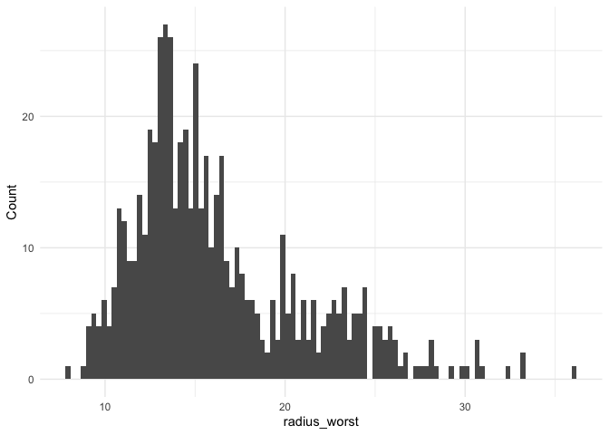

<!-- README.md is generated from README.Rmd. Please edit that file -->

# PlottingTools

<!-- badges: start -->
<!-- badges: end -->

The goal of PlottingTools is to plot histograms for a given data
attribute in a dataframe. The package simplifies the process of
generating histograms for exploratory data analysis and reduce repeated
code use.

## Installation

You can install the development version of PlottingTools like so:

``` r

# install.packages("devtools")
devtools::install_github("https://github.com/stat545ubc-2023/assignment-b2-shycw1.git")
#> Skipping install of 'PlottingTools' from a github remote, the SHA1 (8cd03951) has not changed since last install.
#>   Use `force = TRUE` to force installation
```

## Load the package

``` r
library(PlottingTools)
```

## Example

Basic examples which shows you how to solve a common problem:

**CORRECT Usage 1** plot the histogram of radius_worst with default
histogram bins

``` r

histogram_radius_worst <- plot_histogram(datateachr::cancer_sample, radius_worst)
print(histogram_radius_worst)
```


**CORRECT Usage 2** plot the histogram of radius_worst with specified
histogram bins

``` r

histogram_radius_worst_100 <- plot_histogram(datateachr::cancer_sample, radius_worst, 100)
print(histogram_radius_worst_100)
```



**CORRECT Usage 3** plot the histogram of area_mean with specified
histogram bins

``` r

histogram_area_mean <- plot_histogram(datateachr::cancer_sample, area_mean, 30)
print(histogram_area_mean)
```


